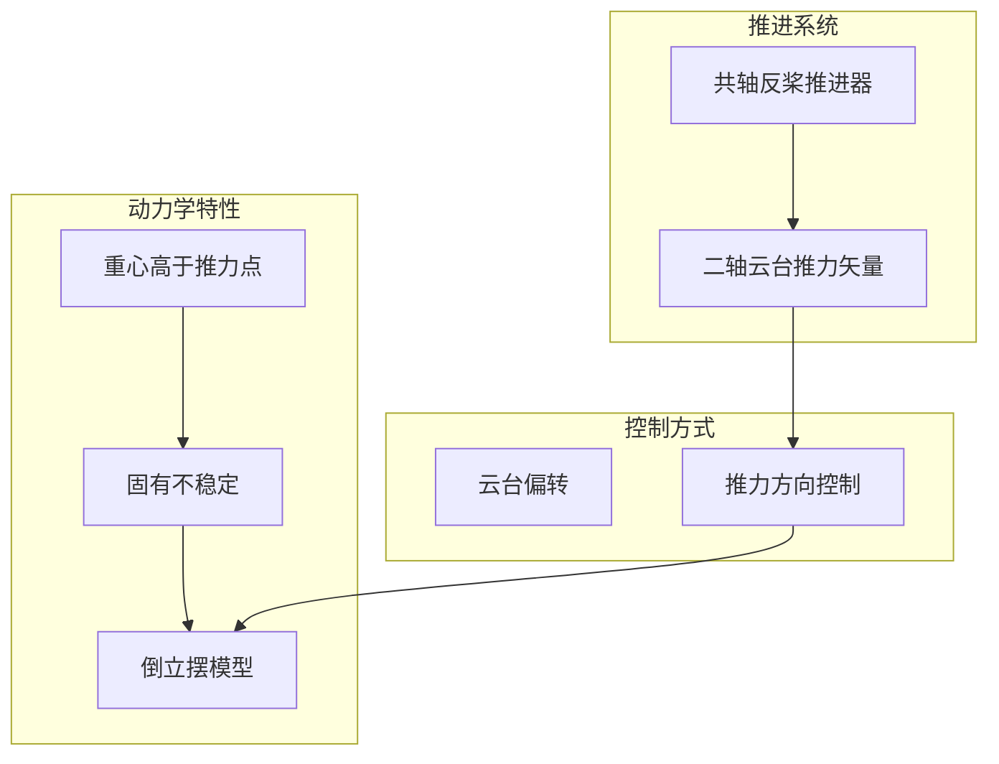
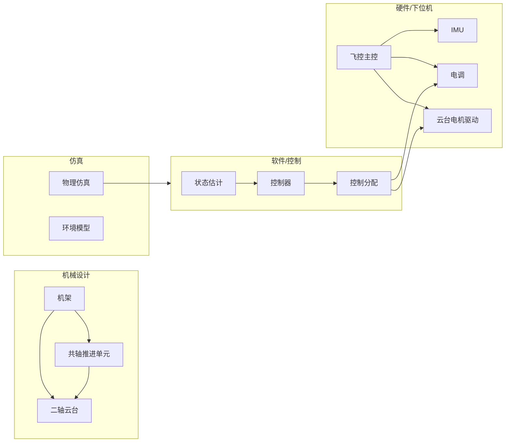

# DroneX 可回收火箭式无人机计划文档

## 一、项目概念概述

### 1.1 核心设计理念

本项目设计一款**重心高于推力作用点**的无人机，通过**推力矢量控制 (TVC)** 实现姿态稳定与运动控制，力学特性类似 SpaceX Falcon 9 垂直着陆阶段的倒立摆系统。



### 1.2 关键技术参数

| 特性       | 描述                      |
| ---------- | ------------------------- |
| **推进方式** | 共轴反桨，向下产生推力，自然抵消反扭矩 |
| **重心位置** | 高于推力作用点（类似火箭着陆姿态） |
| **控制机构** | 二轴云台（俯仰+滚转），由两个无刷减速电机驱动 |
| **飞行模式** | 悬停、平移、垂直降落（含自由落体段） |

**云台轴系选型**：采用俯仰+滚转，直接映射姿态控制需求，响应快、耦合小。偏航控制可通过共轴双桨轻微转速差或后续扩展方案实现。

### 1.3 与常规多旋翼的差异

- **常规多旋翼**：多个电机分散布局，通过各电机转速差实现姿态控制，重心通常低于或接近推力平面
- **本设计**：单一推力源 + 推力矢量偏转，重心在推力之上，控制难度更高但机械结构更紧凑

---

## 二、动力学模型

### 2.1 坐标系定义

- **惯性系**：地面固定，Z 轴向上
- **机体系**：原点在重心，随机体旋转
- **推力系**：随云台偏转，描述推力方向

### 2.2 主要方程

**平动**（牛顿第二定律）：

```
m·a = F_thrust + m·g + F_disturbance
```

其中 `F_thrust` 由云台偏转角 (θ_pitch, θ_roll) 和推力幅值 T 决定。

**转动**（欧拉方程）：

```
I·ω̇ + ω × (I·ω) = τ_thrust + τ_disturbance
```

`τ_thrust` 由推力作用点相对重心的力臂产生。

**倒立摆特性**：重心在推力之上时，推力偏转产生的力矩可稳定姿态，但开环系统不稳定，需闭环控制。

### 2.3 推力矢量与云台关系

云台偏转 (α, β) 将推力从机体 Z 轴偏转至空间方向，产生：

- 姿态控制力矩（推力线不通过重心）
- 水平加速度（推力有水平分量）

---

## 三、系统架构



---

## 四、已确认的技术选型

| 项目     | 选择                         |
| -------- | ---------------------------- |
| 仿真工具 | MATLAB（含 Simulink）        |
| 飞控平台 | STM32H743，从 HAL 库自研飞控 |
| 机械加工 | 3D 打印为主，必要时 CNC      |
| 文档格式 | Markdown                     |
| 云台轴系 | 俯仰 + 滚转                  |

---

## 五、子系统规划

### 5.1 仿真子系统 (`/sim`)

**目标**：在实机开发前验证动力学模型和控制算法。

**工具链**：MATLAB（含 Simulink）

**已实现**（MATLAB 脚本）：

- 刚体动力学（rigid_body_ode）、推力模型（thrust_model）
- 姿态控制器、位置控制器（attitude_controller、position_controller）
- 工具函数：四元数/欧拉角、thrust_dir_to_att、animate_drone
- 运行脚本：run_basic_sim、run_verify_hover（定点悬停、水平平移验证）
- 参数配置：params.m

**内容**：

- 刚体动力学仿真（MATLAB/Simulink）
- 推进器模型：推力-转速关系、共轴干扰系数
- 云台动力学：俯仰+滚转二轴、电机响应、机械限位
- 控制器在环仿真 (CIL)
- 可选：Simscape Multibody 用于机械/接触仿真

**输出**：验证过的控制参数、轨迹规划结果。

### 5.2 下位机/驱动子系统 (`/firmware`)

**目标**：基于 HAL 库从零编写飞控固件与外围驱动。

**硬件平台**：STM32H743，工程位于 `firmware/DroneX_STM32H743_Firmware/`（CubeMX + Keil MDK-ARM）

**内容**：

- **飞控主控**：STM32H743 + CubeMX/HAL，实时控制循环 (200–500 Hz)
- **IMU**：MPU6050 / BMI088，姿态估计（互补滤波或 EKF）
- **电调**：BLHeli/ESC32，主推进电机转速控制
- **云台电机**：无刷减速电机 + FOC 或 PWM 驱动
- **通信**：遥控接收、串口/无线遥测
- **安全逻辑**：低电压保护、失控保护、急停

**输出**：可烧录固件、驱动库、参数配置工具。

### 5.3 机械设计子系统 (`/mechanical`)

**目标**：机架、云台、推进单元的结构与装配设计。

**加工方式**：以 3D 打印为主，需要时采用 CNC 加工。

**已确认设计决策**（详见 mechanical/docs/DESIGN_PLAN.md）：

- **整机重量**：≤ 1 kg
- **机架**：管架为主，火箭外形、细长、底部起落架
- **推进单元**：现成共轴产品
- **云台驱动**：减速电机直驱
- **桨罩**：暂不定

**内容**：

- 机架：管架结构，兼顾强度与重心/推力点位置
- 共轴反桨单元：现成产品，到货后补充规格与安装接口
- 二轴云台：俯仰 + 滚转，减速电机直驱，机械与软件限位
- 电池/载荷布局，保证重心在推力点之上
- 图纸、BOM、3D 打印 STL/STEP 文件，需 CNC 时的加工图

**输出**：CAD 模型、工程图、装配说明。

### 5.4 控制算法 (`/control` 或并入 `/sim`)

**目标**：姿态控制、位置/速度控制、控制分配。

**内容**：

- 姿态控制：串级 PID 或 LQR，内环角速度、外环姿态角
- 位置控制：外环位置/速度 PID
- 控制分配：期望力/力矩 → 推力幅值 T + 云台角 (α, β)
- 降落逻辑：悬停 → 减速下落 → 触地检测 / 缓冲

**输出**：算法文档、仿真验证结果、可移植到飞控的 C 代码。

---

## 六、开发阶段与里程碑

| 阶段           | 主要工作                 | 交付物         |
| -------------- | ------------------------ | -------------- |
| **P0：建模与仿真** | 动力学推导、仿真环境搭建、控制器初步验证 | 仿真报告、控制参数初值 |
| **P1：机械初版**  | 机架、云台、推进单元 CAD 与样机   | 可装配样机       |
| **P2：下位机基础** | 飞控框架、IMU、电调、云台驱动     | 可手动操控的固件    |
| **P3：控制闭环**  | 姿态闭环、悬停、简单轨迹         | 悬停演示        |
| **P4：降落与优化** | 降落逻辑、参数优化、鲁棒性测试      | 完整飞行演示      |

---

## 七、后续细化方向

1. **动力学与建模**：坐标系约定见 sim/docs/dynamics_model.md，参数表已与 params.m 对齐
2. **仿真计划**：详见 sim/docs/SIMULATION_PLAN.md，MATLAB 脚本已实现基础闭环
3. **下位机计划**：详见 firmware/docs/FLIGHT_CONTROL_DESIGN.md
4. **机械设计计划**：详见 mechanical/docs/DESIGN_PLAN.md，已确认管架、共轴产品、减速电机直驱
5. **控制算法计划**：控制结构已实现于 sim/matlab/controllers/，调参流程与鲁棒性待细化
6. **风险与应对**：技术风险清单待补充
