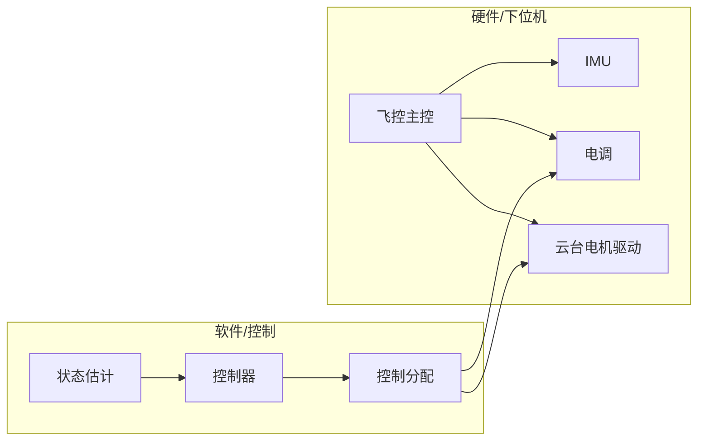
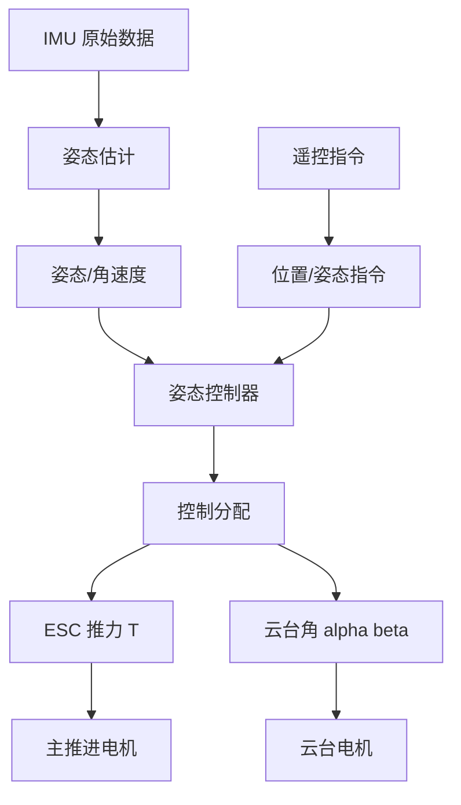

# DroneX 飞控设计文档

> 依据 [PLAN.md](../../docs/PLAN.md) 第 5.2 节及第 7 节「下位机计划」编写。

---

## 〇、已确认技术选型

| 项目           | 选择                         |
| -------------- | ---------------------------- |
| **主控**       | STM32H743                    |
| **HAL 库**     | STM32CubeMX 生成             |
| **控制周期**   | 200–500 Hz（内环 500 Hz，外环 100–200 Hz） |
| **IMU**        | MPU6050 或 BMI088            |
| **电调**       | BLHeli 或 ESC32              |
| **云台电机**   | 无刷减速电机，FOC 或 PWM 驱动 |
| **姿态估计**   | 互补滤波（首版）或 EKF（后续） |

---

## 一、目标与范围

### 1.1 目标

- 基于 HAL 库从零编写飞控固件与外围驱动
- 实现 P2 阶段「下位机基础」：飞控框架、IMU、电调、云台驱动
- 为 P3 控制闭环提供可烧录固件与驱动库

### 1.2 范围

- 飞控主控：STM32H743 + CubeMX/HAL，实时控制循环
- IMU：姿态估计（互补滤波或 EKF）
- 电调：主推进电机转速控制
- 云台电机：无刷减速电机驱动
- 通信：遥控接收、串口/无线遥测
- 安全逻辑：低电压保护、失控保护、急停

### 1.3 对应交付物（P2）

| 交付物         | 说明                           |
| -------------- | ------------------------------ |
| 可烧录固件     | 可手动操控的固件（油门、云台） |
| 驱动库         | IMU、ESC、云台电机等驱动模块   |
| 参数配置工具   | 串口/地面站调参（可选）        |

---

## 二、硬件平台

### 2.1 系统架构（引自 PLAN.md）

### 2.2 主控

| 参数       | 规格         |
| ---------- | ------------ |
| 型号       | STM32H743    |
| 主频       | 480 MHz      |
| 外设需求   | I2C（IMU）、PWM（电调、云台）、UART、ADC（电池电压） |

### 2.3 IMU

| 型号     | 接口   | 备注                     |
| -------- | ------ | ------------------------ |
| MPU6050  | I2C    | 六轴，成本低，易上手     |
| BMI088   | SPI/I2C| 精度更高，适合正式飞行   |

### 2.4 电调

| 类型     | 协议           | 备注                     |
| -------- | -------------- | ------------------------ |
| BLHeli   | PWM / OneShot  | 通用，易采购             |
| ESC32    | UART/串口协议  | 闭环转速，可扩展         |

### 2.5 云台电机

- 无刷减速电机直驱（参见 [mechanical/docs/DESIGN_PLAN.md](../../mechanical/docs/DESIGN_PLAN.md) 选型）
- 驱动方式：FOC（力矩/位置控制）或 PWM（开环/简易闭环）

### 2.6 通信接口

| 用途       | 接口       | 说明                     |
| ---------- | ---------- | ------------------------ |
| 遥控接收   | SBUS/PPM   | 油门、姿态指令、模式切换 |
| 遥测       | UART       | 串口参数、状态上传       |
| 无线遥测   | 可选扩展   | WiFi/数传模块            |

---

## 三、软件架构

### 3.1 模块划分

| 层级       | 模块         | 职责                         |
| ---------- | ------------ | ---------------------------- |
| 应用层     | 状态估计     | IMU → 姿态、角速度           |
| 应用层     | 控制器       | 姿态/位置 PID 或 LQR         |
| 应用层     | 控制分配     | 期望力/力矩 → T + (α, β)     |
| 驱动层     | IMU 驱动     | I2C/SPI 读写、数据解析       |
| 驱动层     | ESC 驱动     | PWM/OneShot 输出             |
| 驱动层     | 云台驱动     | FOC/PWM 输出、位置反馈       |
| 驱动层     | 通信         | 遥控解析、串口遥测           |
| 系统层     | 任务调度     | 定时器、优先级、安全逻辑     |

### 3.2 任务调度

- **高优先级**：内环控制（角速度）500 Hz
- **中优先级**：外环控制（姿态、位置）100–200 Hz
- **低优先级**：遥测、参数更新、安全检测

实现方式：定时器中断 + 主循环，或 RTOS（FreeRTOS）按需引入。

---

## 四、控制流程

数据流：IMU → 姿态估计 → 姿态/位置控制 → 控制分配 → ESC + 云台驱动。

坐标系与动力学约定参见 [sim/docs/dynamics_model.md](../../sim/docs/dynamics_model.md)。

---

## 五、驱动层规划

### 5.1 IMU 驱动

- 初始化：量程、采样率、滤波
- 数据读取：陀螺、加速度计原始值
- 单位转换：转为 rad/s、m/s²
- 对齐：机体系与 IMU 安装方向

### 5.2 电调协议

- PWM：1–2 ms 脉宽映射推力
- OneShot125/OneShot42：缩短最小脉宽，提高分辨率
- ESC32：若采用，需实现串口协议解析

### 5.3 云台电机驱动

- **PWM 模式**：简易开环，脉宽映射期望角速度/位置
- **FOC 模式**：力矩/位置闭环，需编码器或霍尔反馈
- 限位：软件限位 + 机械限位（与 [mechanical/docs/gimbal/README.md](../../mechanical/docs/gimbal/README.md) 对齐）

### 5.4 遥控接收

- SBUS：串口协议，多通道
- PPM：单线多通道 PWM
- 解析：油门、俯仰/滚转/偏航指令、模式开关

### 5.5 串口遥测

- 输出：姿态、角速度、云台角、推力、电池电压
- 格式：自定义或 MAVLink 等标准协议（可选）

---

## 六、安全逻辑

| 项目         | 触发条件           | 动作                     |
| ------------ | ------------------ | ------------------------ |
| 低电压保护   | 电池电压 < 阈值    | 降推力、告警、逐步降落   |
| 失控保护     | 遥控信号丢失超时   | 悬停/降落/急停（可配置） |
| 急停         | 遥控急停开关       | 立即切断推力             |
| 上电自检     | 启动时             | IMU 校准、云台归中、电调初始化 |

---

## 七、与 HAL 工程的关系

### 7.1 hal_project 目录用途

- 本目录下 `hal_project/` 用于存放 STM32CubeMX 生成的 HAL 库空白工程
- 用户导入工程后，自研代码（状态估计、控制器、驱动）放在独立目录或 `hal_project/Core/` 下的自研模块中

### 7.2 CubeMX 配置建议

- 时钟：HSE + PLL，主频 480 MHz
- 定时器：用于控制周期（如 2 ms → 500 Hz）
- I2C：IMU（MPU6050/BMI088）
- PWM：电调通道、云台电机
- UART：遥控、遥测
- ADC：电池电压采样

### 7.3 自研代码与 HAL 的集成方式

- 在 `hal_project/Core/` 下创建 `dronex/` 或类似子目录，存放飞控应用与驱动
- 主循环或定时器中断中调用 `dronex_task_run()` 等入口
- 避免在 HAL 生成代码区域内手改，通过 `USER CODE` 块或外部调用集成

---

## 八、里程碑与依赖

| 子任务         | 依赖           | 产出                     |
| -------------- | -------------- | ------------------------ |
| M0：框架搭建   | HAL 工程导入   | 空循环、定时器、串口打印 |
| M1：IMU 驱动   | 框架           | IMU 数据读取与单位转换   |
| M2：电调驱动   | 框架           | PWM 输出、推力可控       |
| M3：云台驱动   | 框架           | 云台角可控               |
| M4：姿态估计   | IMU 驱动       | 互补滤波姿态输出         |
| M5：开环操控   | M1–M4          | 可手动操控的固件         |
| M6：闭环控制   | M5 + sim 参数  | 姿态闭环、悬停（P3）     |

与 [PLAN.md](../../docs/PLAN.md) P2/P3 阶段对应：M0–M5 对应 P2，M6 对应 P3。

---

## 九、参考与引用

- [PLAN.md](../../docs/PLAN.md) §5.2 下位机/驱动子系统
- [PLAN.md](../../docs/PLAN.md) §6 开发阶段 P2、P3
- [sim/docs/dynamics_model.md](../../sim/docs/dynamics_model.md) — 坐标系、运动方程
- [docs/literature/04-flight-control-and-estimation.md](../../docs/literature/04-flight-control-and-estimation.md) — 姿态控制、状态估计、控制分配
- [mechanical/docs/DESIGN_PLAN.md](../../mechanical/docs/DESIGN_PLAN.md) — 云台电机选型、限位
