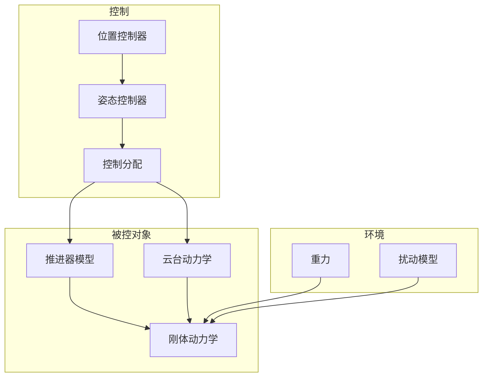

# DroneX 仿真计划

仿真子系统的目标、结构、流程与验证标准。对应项目主计划 [PLAN.md](../docs/PLAN.md) 中 P0 阶段与仿真子系统规划。

---

## 1. 目标与范围

### 1.1 目标

- 在实机开发前验证动力学模型与控制算法
- 提供可调参数初值，供 P2/P3 阶段飞控与闭环控制使用
- 支持轨迹规划与降落逻辑的离线验证

### 1.2 范围

- 刚体六自由度动力学
- 推进器与云台子模型
- 姿态与位置控制器
- 控制器在环仿真 (CIL)

### 1.3 对应交付物（P0）

| 交付物           | 说明                               |
| ---------------- | ---------------------------------- |
| 仿真报告         | 模型验证结果、典型场景仿真曲线、结论 |
| 控制参数初值     | PID/LQR 等参数，供飞控移植与调优    |

---

## 2. 工具链

| 组件               | 版本/要求                     | 用途                     |
| ------------------ | ----------------------------- | ------------------------ |
| MATLAB             | R2021b 或更高                 | 脚本、函数、数据处理     |
| Simulink           | 随 MATLAB                     | 动力学与控制仿真         |
| Simscape Multibody | 可选                          | 机械/接触仿真（后续扩展）|

---

## 3. 模块规划

### 3.1 刚体动力学

- 平动：牛顿第二定律，机体系与惯性系转换
- 转动：欧拉方程，四元数/欧拉角姿态表示
- 参考：[dynamics_model.md](dynamics_model.md)

### 3.2 推进器模型

- 推力与转速关系（待测或基于经验公式）
- 共轴干扰系数（上/下桨效率差异）
- 建模位置：`matlab/models/`、`simulink/models/` 或 `simulink/lib/`

### 3.3 云台动力学

- 俯仰 + 滚转二轴
- 电机响应（一阶或二阶近似）、机械限位
- 输入：期望云台角 (α, β)；输出：实际云台角及角速度

### 3.4 控制器

- 姿态控制：内环角速度、外环姿态（串级 PID 或 LQR）
- 位置控制：外环位置/速度 PID
- 控制分配：期望力/力矩 → 推力幅值 T + 云台角 (α, β)
- 建模位置：`matlab/controllers/` 或 Simulink 子模块

### 3.5 环境扰动

- 重力（常值）
- 风/阵风（可选，用于鲁棒性测试）

---

## 4. 项目结构

| 路径                     | 职责                             |
| ------------------------ | -------------------------------- |
| `sim/docs/`              | 仿真文档（本计划、动力学、验证） |
| `sim/matlab/models/`     | 动力学、推进器、云台等 M 函数    |
| `sim/matlab/controllers/`| 控制器 M 函数或封装              |
| `sim/matlab/utils/`      | 坐标变换、绘图等工具函数         |
| `sim/matlab/scripts/`    | 运行脚本、参数配置、批量仿真     |
| `sim/simulink/models/`   | 主仿真 .slx 模型                 |
| `sim/simulink/lib/`      | 可复用 Simulink 库块             |
| `sim/data/results/`      | 仿真输出、日志、绘图             |

---

## 5. 仿真流程

### 5.1 参数配置

- 在 `matlab/scripts/` 中定义或加载 `params.m` 等
- 包含：质量、惯量、重心/推力点、推进器系数、云台限位、控制参数

### 5.2 模型加载

- 启动 MATLAB 后，将 `sim/matlab` 加入路径
- 打开 Simulink 主模型，自动加载 Base Workspace 参数

### 5.3 运行仿真

- 设置仿真时长、求解器（ode4 等固定步长推荐）
- 运行 Simulink 或调用 `sim()` 脚本

### 5.4 结果分析

- 姿态角、角速度、位置、速度曲线
- 云台角、推力、控制量
- 与 [verification.md](verification.md) 中指标对比

### 5.5 报告导出

- 将典型曲线保存至 `data/results/`
- 生成仿真报告（Markdown 或 PDF）

---

## 6. 验证标准

详见 [verification.md](verification.md)，概要如下：

- **姿态稳定**：阶跃响应上升时间、超调、稳态误差
- **悬停**：位置/速度误差、姿态偏差
- **抗扰**：施加扰动后的恢复时间与残余误差

---

## 7. 里程碑与依赖

| 子任务                   | 依赖                     | 产出                     |
| ------------------------ | ------------------------ | ------------------------ |
| 动力学方程推导与参数表   | 无                       | dynamics_model.md 定稿   |
| 刚体动力学 Simulink 实现 | 动力学方程               | 六自由度仿真块           |
| 推进器与云台模型         | 参数/实测数据            | 推力与云台子模块         |
| 控制器初步设计           | 控制算法方案             | 姿态/位置控制器模块      |
| 开环验证                 | 刚体+推进器+云台         | 开环响应曲线             |
| 闭环验证                 | 控制器+闭环结构          | 闭环响应、参数初值       |
| 仿真报告                 | 闭环验证、验证标准       | 报告文档、控制参数初值   |

---

## 8. 与主文档的关联

- 总体规划：[docs/PLAN.md](../docs/PLAN.md)
- 动力学基础：PLAN.md 第二章；细化在 [dynamics_model.md](dynamics_model.md)
- 控制算法规划：PLAN.md 5.4；实现与验证在仿真子系统中完成
